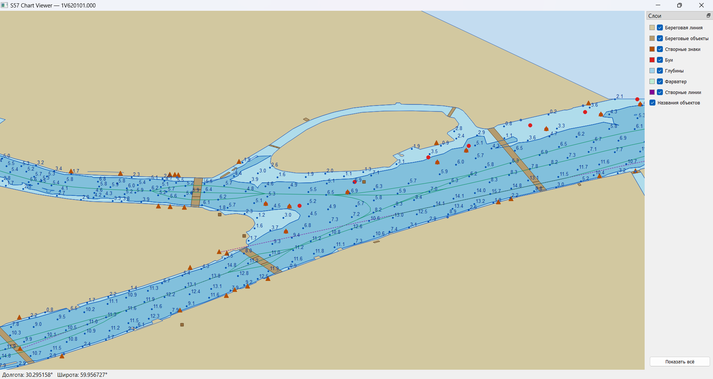

# S57 Chart Viewer

Десктопное приложение для просмотра морских навигационных карт в формате S-57 (IHO).  
Реализовано на C++14 с использованием Qt5 и GDAL.

---

## Функциональность

### Отображение карты

- Загрузка одного или нескольких файлов S-57 (`.000`) — отображаются как единая карта
- Морской фон (голубой) с цветовым разделением суши и воды
- Градиентная окраска глубинных зон (`DEPARE`) по минимальной глубине:
  - светло-голубой → тёмно-синий (от мелководья к большим глубинам)

### Слои с фильтрацией

Слои можно включать и выключать независимо в панели справа:

| Слой | S57-классы |
| ---- | ---------- |
| Береговая линия | `COALNE`, `LNDARE`, `SLCONS` |
| Береговые объекты | `LNDMRK`, `BUAARE`, `BRIDGE`, `MORFAC`, `HULKES`, `HRBARE`, `DOCARE`, `PRTARE` |
| Створные знаки | `BCNLAT`, `BCNCAR`, `BCNISD`, `BCNSAW`, `BCNSPP`, `LIGHTS` |
| Буи | `BOYLAT`, `BOYCAR`, `BOYISD`, `BOYSAW`, `BOYSPP`, `BOYINB` |
| Глубины | `SOUNDG`, `DEPARE`, `DEPCNT` |
| Фарватер | `FAIRWY`, `RECTRC`, `TSSLPT`, `TSSRON` |
| Створные линии | `NAVLNE`, `TRSLNE` |
| Названия объектов | атрибут `OBJNAM` всех точечных объектов |

Панель слоёв содержит легенду — цветной квадрат рядом с каждым чекбоксом.

### Навигационные знаки — два режима отображения

Буи и створные знаки можно отображать двумя способами (переключается кнопкой в панели):

- **Фигуры** — геометрические примитивы (треугольник для знаков, круг для буёв)
- **Иконки PNG** — индивидуальный PNG-файл для каждого S57-класса из папки `icons/`
  рядом с `MapRenderer.exe`. При отсутствии файла показывается цветная заглушка.

Размер иконок задаётся спинбоксом «Размер знаков» (8–128 px, по умолчанию 24 px).

Ожидаемые имена файлов иконок:

| Знаки | Буи |
| ----- | --- |
| `BCNLAT.png` | `BOYLAT.png` |
| `BCNCAR.png` | `BOYCAR.png` |
| `BCNISD.png` | `BOYISD.png` |
| `BCNSAW.png` | `BOYSAW.png` |
| `BCNSPP.png` | `BOYSPP.png` |
| `LIGHTS.png` | `BOYINB.png` |

### Навигация

| Действие | Управление |
| -------- | ---------- |
| Перемещение карты | Зажать ЛКМ и тянуть |
| Приближение | Колесо вверх |
| Удаление | Колесо вниз |
| Приближение ×2 | Двойной клик ЛКМ |
| Показать всю карту | Кнопка «Показать всё» |

### Статусная строка

Отображает текущие координаты курсора в десятичных градусах (долгота / широта).

---

## Архитектура

```text
src/
├── main.cpp          — точка входа, множественный выбор файлов
├── MainWindow.h/cpp  — главное окно (QMainWindow): панель слоёв, статусбар
├── MapWidget.h/cpp   — виджет отрисовки карты (QPainter + mouse/wheel events)
├── S57Loader.h/cpp   — загрузка S57 через GDAL OGR, классификация по слоям
└── MapFeature.h      — структуры данных (MapFeature, LayerType)
```

### Публичный API MapWidget

```cpp
// Конструктор — список карт в формате base64 (как от сервера)
MapWidget(const QList<QString>& charts = {}, QWidget* parent = nullptr);

// Добавить карту (base64-строка). Первая карта — fitAll(), последующие — update()
void addChart(const QString& base64data);

// Очистить все карты
void clearCharts();

// Режим отображения навигационных знаков
void setMarkerMode(MarkerMode mode);   // Shapes | Icons

// Размер иконок в пикселях (с перерисовкой)
void setMarkerSize(int pixels);
```

### Поток данных

```text
base64-строка (от сервера или из файла)
   ↓
S57Loader::loadFromBase64()  ← GDAL OGR через /vsimem/ (без записи на диск)
   ↓
QVector<MapFeature>          ← геометрия + атрибуты + LayerType + s57class
   ↓
MapWidget::addChart()        ← накапливает features, обновляет общий bbox
   ↓
MapWidget::paintEvent()      ← QPainter: Area → Line → Point (z-порядок слоёв)
```

### Координатное преобразование

S57 хранит координаты в десятичных градусах WGS84.  
`MapWidget` использует линейное преобразование с сохранением пропорций:

```text
screenX =  lon * scale + panX
screenY = -lat * scale + panY   // ось Y перевёрнута
```

Параметры `scale` и `pan` обновляются при pan/zoom/fitAll.

---

## Зависимости

| Библиотека | Версия | Назначение |
| ---------- | ------ | ---------- |
| Qt5 | 5.x | GUI, отрисовка, события |
| GDAL | 3.x | Чтение S57, геопространственные данные |
| GCC / MinGW | 15.x | Компилятор C++14 |

---

## Установка окружения (Windows, MSYS2)

### 1. Установить MSYS2

Скачать установщик с [msys2.org](https://www.msys2.org/), установить в `C:\msys64`.

### 2. Обновить базы пакетов

Открыть **MSYS2 MSYS** и выполнить:

```bash
pacman -Syu
```

Закрыть терминал, открыть снова и повторить.

### 3. Установить зависимости

Открыть **MSYS2 MinGW64** и выполнить:

```bash
pacman -S mingw-w64-x86_64-toolchain mingw-w64-x86_64-cmake \
          mingw-w64-x86_64-gdal mingw-w64-x86_64-qt5-base \
          mingw-w64-x86_64-qt5-tools
```

### 4. Настроить VSCode

- Установить расширения: **C/C++** и **CMake Tools** (Microsoft)
- В настройках VSCode (`Ctrl+,`) указать путь к CMake:

  ```text
  cmake.cmakePath: C:/msys64/mingw64/bin/cmake.exe
  ```

- В **CMake Tools → Edit User-Local CMake Kits** добавить кит:

  ```json
  [{
    "name": "MSYS2 MinGW64 GCC",
    "compilers": {
      "C":   "C:/msys64/mingw64/bin/gcc.exe",
      "CXX": "C:/msys64/mingw64/bin/g++.exe"
    },
    "generator": "MinGW Makefiles",
    "environmentVariables": {
      "PATH": "C:/msys64/mingw64/bin;${env:PATH}"
    }
  }]
  ```

---

## Сборка и запуск

### Через VSCode

1. `Ctrl+Shift+P` → **CMake: Configure**
2. `Ctrl+Shift+P` → **CMake: Build**
3. `Ctrl+Shift+P` → **CMake: Run Without Debugging**

### Через терминал (MSYS2 MinGW64)

```bash
cd /e/map-renderer
mkdir build && cd build
cmake .. -G "MinGW Makefiles"
mingw32-make
./MapRenderer.exe
```

При запуске без аргументов откроется диалог выбора файлов (поддерживается выбор нескольких).  
При запуске с аргументами — загружаются все переданные файлы:

```bash
./MapRenderer.exe "../S57 viewer/Карты формата S57/8R6E0401.000" \
                  "../S57 viewer/Карты формата S57/8R6E0402.000"
```

## Рабочее окно приложения



---

## Известные ограничения

- Приложение работает автономно, без подключения к интернету
- Поддерживаются только файлы стандарта IHO S-57 Edition 3.1 (`.000`)
- Глубины на промерах (`SOUNDG`) отображаются только при достаточном масштабе
- Иконки знаков — папка `build/icons/` должна содержать PNG-файлы с именами S57-классов;
  при отсутствии показываются цветные заглушки